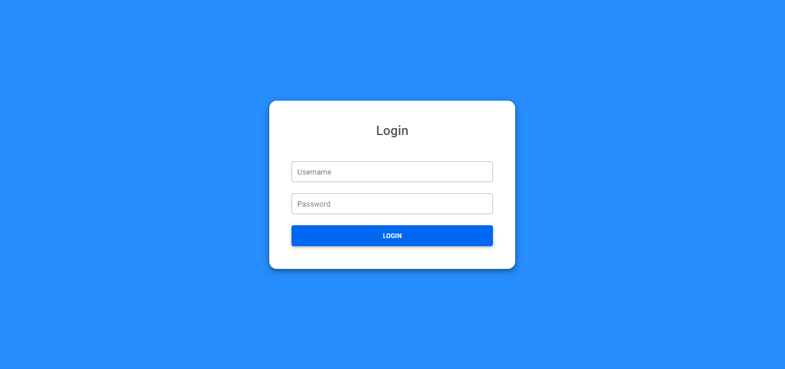

# S. Chand Offline Resource Portal

## About

    This website contains sales person, school and titles information about Offline Request.
	

## Requirements
	node version: 16.16.0
	mongoDB version: minimum 4
	for developer: 
		nodemon
		command: npm run dev
	for live:
		command: npm start
		
	NOTE: Make sure create a .env file and mention below parameters
		PORT=5000
		MONGODB_URL=mongodb://127.0.0.1:27017/
		SESSION_SECRET= [ Contact admin for this string ]

## Features

### V 1.0
#### Main Dashboard
#### School Details
#### Sales person Details
#### All pending/complete requests

### v 2.0
#### Login/Register

### v 3.0
#### Backup
##### Download backup in json
##### Download backup in csv

### v 4.0
#### Add pegination feture

### v 5.0
#### ubuntu 16.04 setup

### v 6.0
#### Add subject lists in menu